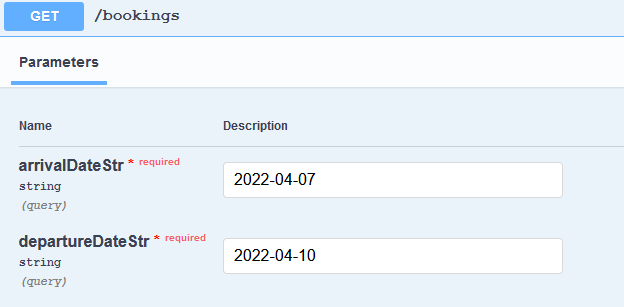
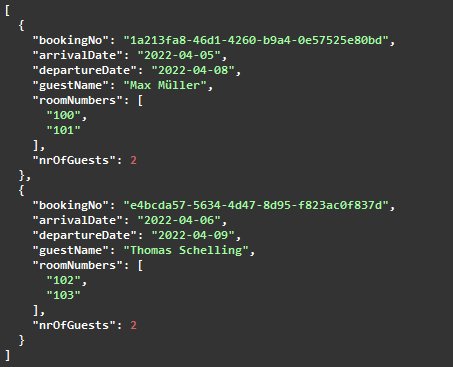
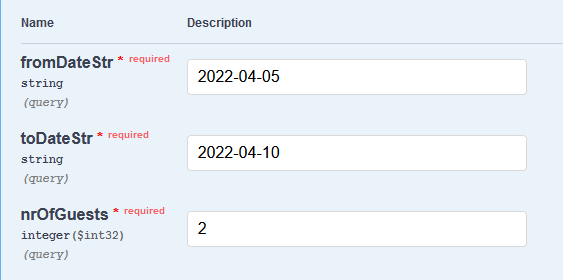
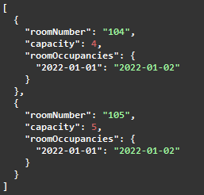
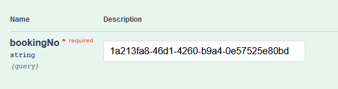
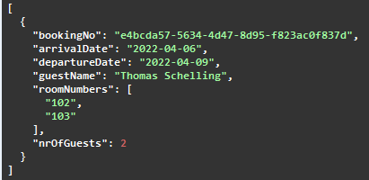
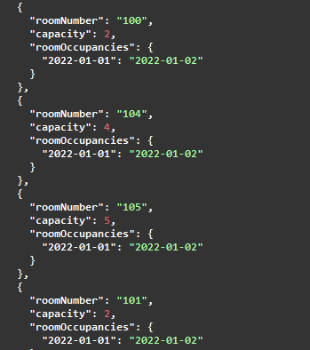

#Exercise Lab 1
##Command and Query Responsibility Segregation (CQRS)
######By Hüseyin Arziman & Yusuf Cetinkaya

In this Lab exercise ...

###<ins>Event Side:</ins>
The event side uses the publish-subscribe mechanism in order to notify the subscribers of incoming events. 
But in order to realize this pattern, the subscribers first have to subscribe themselves to a specific event, 
which they are interested in. In our case the `BookingProjector` makes a rest call with the parameters that 
contain the event names it wants to get notified when an updated happens in the event repository. 
Our single source of truth is the event store, because both internal storage of the write as well as the readside 
could theoretically be volatile.

###<ins>Read Side:</ins>
The read side acts like a cache for reading. It needs to use an independent database which is optimized for 
fast reading, which means that the stored data is denormalized to avoid joins. When querying data from the readside
it only returns data without side effects. The data that is provided is eventual consistent, which means that it takes 
some time in order to read the latest data changes. But in many cases this `drawback` is just fine because 
as the CAP-Theorem says, we can only have two of the desired three attributes in distributed systems. 
So by using CQRS we have the two desired attributed (Partition Tolerance and Availability) plus eventual consistency.
Another advantage is that the read side is still available even if the write side fails.

###<ins>How to start the project:</ins>
1. Start the Event Side
2. Start the Write Side
3. Start the Read Side

After starting the read side, you should see in the logs of the event side that the read side has registered itself for the BookingCreatedEvent and the BookingCancelledEvent.

In order to create or cancel a booking use the SwaggerUI under http://localhost:8081/swagger-ui/index.html

In order to get the free rooms or bookings within a timespan you can also use the SwaggerUI under: http://localhost:8082/swagger-ui/index.html

###<ins>Documented results:</ins>

######Book Room:

#####Get Bookings:

######Result:

#####Get Free Rooms:

#####Result:

#####Cancel Booking of Max Müller:

#####Result of Bookings (Max Müller was cancelled):

#####Get Free Rooms (Rooms of Max Müller now available):
