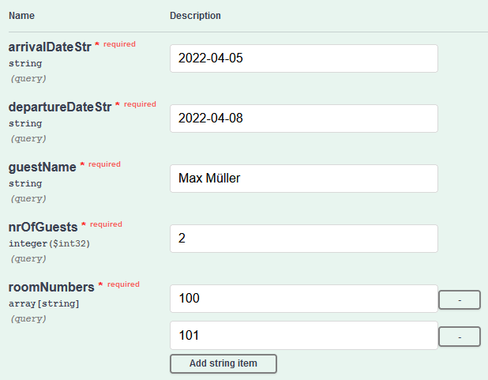

#Exercise Lab 1
##Command and Query Responsibility Segregation (CQRS)
######By Hüseyin Arziman & Yusuf Cetinkaya

The CQRS architecture is based on the CQS design pattern (Command Query Separation), which proposes an assignment
of methods of an object to two categories: Either a method changes the internal state of the object, but then returns nothing. 
Such a method is called "Command". Or a method returns information, but then does not change the internal state. Such a method 
is called "Query". Basically, CQS is about separating write and read operations with regard to a single object. Greg Young coined 
the CQRS (Command Query Responsibility Segregation) architectural pattern in 2010 based on the CQS pattern. It also separates writing 
from reading, but in terms of the API. It therefore proposes separate APIs, one dedicated to command routes that change the state of the 
application and the other to query routes that return information about the state of the application, taking the idea of CQRS further, it 
also seems reasonable to separate the database behind the API into two databases. One should be optimised for writing, the other for 
reading - for example, by strongly normalising one and denormalizing the other. In this way, good integrity and consistency can be 
guaranteed when writing, but at the same time high efficiency and performance can be achieved when reading.

In this Lab exercise ...

###<ins>Write Side:</ins>
The write side basically has the same structure as in the 4-layered architecture. The customer's input 
(booking a room, cancelling a booking) is received via a rest api and is then converted into a command that goes into the application layer.
Within the command **simple** validation is present, like that the arrival date has to be prior the departure date. 
This decision was made, because it is only a valid command, if the user's input is also valid. After the command has arrived
at the application layer it again runs through some validation which this time concerns more specific validation (presence of given room numbers,
if the number of guests fit in the selected rooms with their capacity). If the validation succeeded the `Booking `domain object can be created
which also validates if the business invariants are fulfilled (e.g. at least on guest has to be present). 
In case of a negative validation, an error message is returned. After the `Booking` has been created, it is saved in the write
repository. Furthermore, an `BookingCreatedEvent` is instantiated which includes the necessary information for the
read side data storage and is published via the `EventPublisher`.

###<ins>Event Side:</ins>
The event side uses the publish-subscribe mechanism in order to notify the subscribers of incoming events. 
But in order to realize this pattern, the subscribers first have to subscribe themselves to a specific event, 
which they are interested in. In our case the `BookingProjector` makes a rest call with the parameters that 
contain the event names it wants to get notified when an updated happens in the event repository. 
Our single source of truth is the event store, because both internal storage of the write as well as the readside 
could theoretically be volatile.

###<ins>Read Side:</ins>
The read side acts like a cache for reading. It needs to use an independent database which is optimized for 
fast reading, which means that the stored data is denormalized to avoid joins. When querying data from the readside
it only returns data without side effects. The data that is provided is eventual consistent, which means that it takes 
some time in order to read the latest data changes. But in many cases this *drawback* is just fine because 
as the CAP-Theorem says, we can only have two of the desired three attributes in distributed systems. 
So by using CQRS we have the two desired attributed (Partition Tolerance and Availability) plus eventual consistency.
Another advantage is that the read side is still available even if the write side fails.

###<ins>How to start the project:</ins>
**Important**: use JDK 11
1. Start the Event Side
2. Start the Write Side
3. Start the Read Side

After starting the read side, you should see in the logs of the event side that the read side has registered itself for the BookingCreatedEvent and the BookingCancelledEvent.

In order to create or cancel a booking use the SwaggerUI under http://localhost:8081/swagger-ui/index.html

In order to get the free rooms or bookings within a timespan you can also use the SwaggerUI under: http://localhost:8082/swagger-ui/index.html

###<ins>Test Scenario:</ins>

###Book Room:  

###Get Bookings:  

###Result:  

###Get Free Rooms:  

###Result:  

###Cancel Booking of Max Müller:  

###Result of Bookings (Max Müller was cancelled):  

###Get Free Rooms (Rooms of Max Müller now available):  

